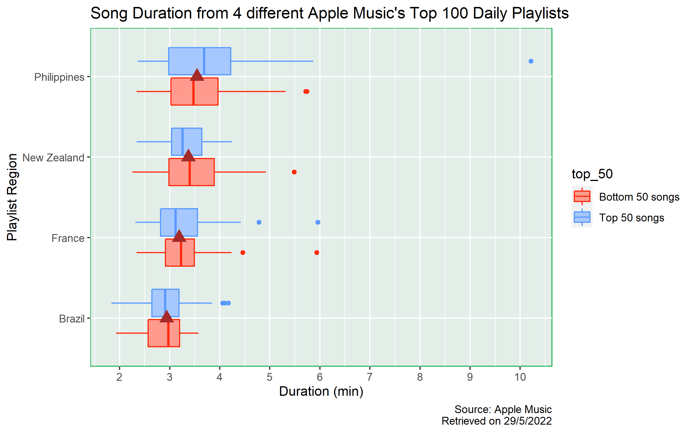
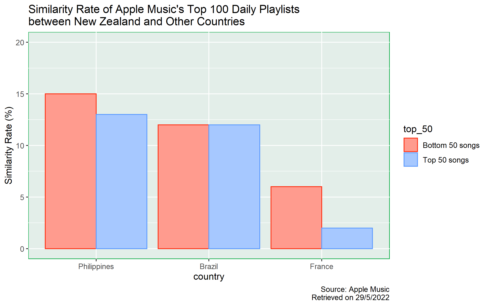

```{css, echo = FALSE}
@import url('https://fonts.googleapis.com/css2?family=Open+Sans&family=Poppins:wght@700&display=swap');

body {
      background-color: #F5FFDC;
}

h1 {
    background-color: #32612D;
    color: #FFFFFF;
    font-family: 'Poppins', sans-serif;
    padding: 20px;
}

h2 {
    background-color: #32612D;
    color: #FFFFFF;
    font-family: 'Poppins', sans-serif;
    padding: 20px;
}

h3 {
    background-color: #32612D;
    color: #FFFFFF;
    font-family: 'Poppins', sans-serif;
    padding: 10px;
}

h4 {
    background-color: #32612D;
    color: #FFFFFF;
    font-family: 'Poppins', sans-serif;
    padding: 10px;
}

p {
    background-color: #D6FFBF;
    color: #000000;
    font-family: 'Open Sans', sans-serif;
    padding: 10px;
}

```

```{r setup, include=FALSE}
knitr::opts_chunk$set(echo = TRUE,
                      message = FALSE,
                      fig.width = 8,
                      fig.height = 5)

library(tidyverse)

country_median_duration = readRDS("data_country_median_duration.RDS")
common_song_nz_ref = readRDS("data_common_song_nz_ref.RDS")
```

## Introduction

I selected 4 different Apple Music top 100 playlists: Brazil, France, New Zealand and Philippines.

I chose the playlists from these 4 countries because the official language(s) for each country was not the same.

Official Language(s):

* Brazil: Portuguese
* France: French
* New Zealand: English & Maori
* Philippines: English & Filipino

I would like to explore the differences in terms of the duration of songs and similarity among these playlists.

In the meantime, I would also like to investigate whether the top 50 songs in each playlist behaved differently to the bottom 50 songs.

For duration, minute has long been accepted as the unit of length for songs. Therefore, I would compare the difference in median duration (in minutes) for each playlist and level. I chose median instead of mean because median would unlikely to be affected by extreme values.

To measure similarity, I would count the number of common songs in the baseline group and non-baseline group. Since each playlist contains 100 songs, the number of common songs is also the percentage of similarity. In this study, I chose New Zealand as the baseline group.


## Visualisation

**Duration**


From the plot, we can see that the median duration of songs in different countries are approximately the same as indicated by the brown triangles. The lowest median duration is approximately 3 mins from Brazil's top 100 playlist, whereas the highest median duration is roughly 3.5 mins from the Philippines' top 100 playlist.

Also, it seems that the median duration between the top 50 songs and the bottom 50 songs within each playlist is roughly the same, all with differences smaller than 0.5 mins.

However, the variability and skewness behaves differently in each playlist. In France, New Zealand and Philippines, the distributions are right skewed. But, the variability in Philippines top 100 playlist is much higher than all other countries and there is one outlier with duration of more than 10 mins. For Brazil, the distribution is roughly normally distributed (in both top and bottom 50 songs).

Therefore, for the difference in median duration, based on the visualisation, there are only slight differences between different countries. We do not know whether the difference is statistically significant or not. Also, it seems that the median duration is independent from whether the song is from the top 50 or the bottom 50 group.

## Data Creation

**Similarity**


***Philippines***

From the chart, we can see that Philippines' top 100 playlist is the most similar playlist to New Zealand's. The total similarity rate is `r sum(filter(common_song_nz_ref %>% ungroup(), country_name == "Philippines")$similarity)`%, with `r filter(common_song_nz_ref %>% ungroup(), country_name == "Philippines", top_50 == "Bottom 50 songs")$similarity`% contributed from the bottom 50 songs and `r filter(common_song_nz_ref %>% ungroup(), country_name == "Philippines", top_50 == "Top 50 songs")$similarity`% contributed from the top 50 songs.
The similarity rate contribution from the bottom 50 songs group is greater than that of the top 50 songs group by `r filter(common_song_nz_ref %>% ungroup(), country_name == "Philippines")$similarity[1] - filter(common_song_nz_ref %>% ungroup(), country_name == "Philippines")$similarity[2] %>% abs()`%.

***Brazil***

The similarity rate between Brazil and New Zealand top 100 playlist is `r sum(filter(common_song_nz_ref %>% ungroup(), country_name == "Brazil")$similarity)`%. We cannot see any difference in the proportions between the top 50 songs and bottom 50 songs groups, both of which contribute `r filter(common_song_nz_ref %>% ungroup(), country_name == "Brazil")$similarity[1]`% to similarity.

***France***

Top 100 playlist in France has the least similarity rate, with only `r sum(filter(common_song_nz_ref %>% ungroup(), country_name == "France")$similarity)`% in total. We can see that the similarity rate contribution from the bottom 50 songs group is `r filter(common_song_nz_ref %>% ungroup(), country_name == "France", top_50 == "Bottom 50 songs")$similarity`%, whereas the similarity rate contribution from the top 50 songs group is `r filter(common_song_nz_ref %>% ungroup(), country_name == "France", top_50 == "Top 50 songs")$similarity`%, showing a `r filter(common_song_nz_ref %>% ungroup(), country_name == "France")$similarity[1] - filter(common_song_nz_ref %>% ungroup(), country_name == "France")$similarity[2] %>% abs()`-percent difference.

**Summary**

For similarity, there are only slight differences between whether a song is from the top 50 songs group or not in both Philippines and Brazil; in France, there is a 4% difference. To determine whether the 4% difference is statistically significant or not, further investigation shall be conducted.

The overall similarity of the top 100 playlist from Philippines, Brazil and France are 28%, 24% and 8%. One possible reason for Philippines' top 100 playlist having the highest similarity rate might be due to the fact that English is one of the official languages in both Philippines and New Zealand.

**Limitations**
However, there are limitations in this study.

Firstly, Apple Music users might use VPN services when they accessed their accounts. Therefore, the ranking of songs might not truly reflect the song popularity in that country.

Secondly, the sample is not representative enough. Users of different streaming platforms might have different preferences in listening to music. Also, some of the songs might not be provided or available in certain region due to copyright issues. Therefore, further study should be conducted.

**Used knowledge and techniques from Stats 220**

First of all, I used the `filter()` function to extract all rows related to New Zealand Top 100 playlist and add a `$` to extract the vector of the `trackId` of the songs in the playlist.

After that, I used `mutate()` function to include several variables in the `song_data` data frame. To determine whether a song from other countries' top 100 playlist is also included in New Zealand top 100 playlist, I used `trackId %in% nz_song_id` to get a vector with `TRUE` and `FALSE`. If a song is in both playlists, it will return TRUE, otherwise FALSE.

Since I also want to separate songs into 2 levels, namely Top 50 songs and Bottom 50 songs, I need to compare whether the rank of a song is above or below rank 50. However, in the `rank` variable, since the numbers are directly extracted from the webpage, they all belong to the character class, and I cannot make direct comparison with the value 50. Therefore, I converted the rank number into numeric class and mutate them in the data frame with variable name: `rank_numberic`.

Next, I used the `summarise()` and `group_by()` functions together to get the count of common songs and assign the summarised data frame to a variable. Therefore, I could use this summarised data in the ggplot() function when I created the plot.

As ggplot provides a layered grammar of graphics framework, apart from the base layer and geometry layer, I added labels, title and captions in order to make the information in the plot to be more comprehensive. I also change the y-axis scale as the default scale is not informative enough. And finally, I also changed the bar and panel colours to best suit the theme in my report.

## Final Reflection

I think the most important idea I learnt from Module 5 is that we need to be responsible when we conduct web scraping. Learning the web scrapping techniques and knowledge is not hard, but we need to be extremely careful to judge whether we should start web scrapping the data from the internet. It is because we should ensure that our actions will not overload the website server or violate terms of a website. Therefore, we need to follow the websites' terms and conditions. If they disallow us from web scrapping, we should not web scrap the data. Instead, we should contact the owner of the website to ask for permission.

From these assignments, I understand that in order to well present ideas to others, apart from having good writing skills, we need to know how to use codes. By using programming code, we can save a lot of time in creating different data frames or even visualisations.

Also, we should try integrating skills from different modules. For example, in previous modules and assignments, we learnt how to deal with dynamic data. I think the same technique can also apply to web scrapping since the content in a website will also change from time to time. By using the inline R code technique, we do not need to update each value or figure by hand.

I am curious to learn more about using R codes to deal with different problems. Although codes taught in this course are sufficient to solve basic problems, I believe that there will be some other codes which are more efficient. It is because in the real world, data sets are usually complex and big, we should always look for codes with the lowest time complexity so that we can solve the problem within reasonable time.

## Code Appendix
```{r file='data_web.R', eval=FALSE}

```

```{r file='data_api.R', eval=FALSE}


```

```{r file='data_join.R', eval=FALSE}

```

```{r file='data_viz.R', eval=FALSE}

```

```{r file='data_creativity.R', eval=FALSE}

```

### Last Update
01/06/2022

## Back to Home Page
[Click here](https://220pmc.github.io/portfolio/)